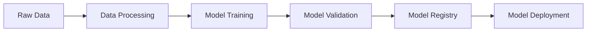
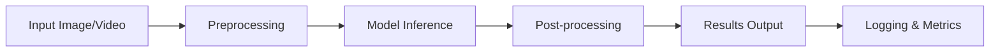
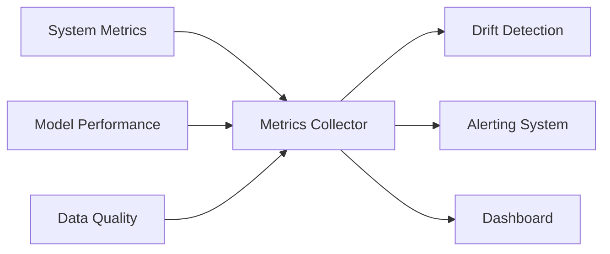

# Face Mask Detection MLOps Pipeline - Project Documentation

## 📋 Table of Contents
1. [Project Overview](#project-overview)
2. [Project Structure](#project-structure)
3. [Pipeline Architecture](#pipeline-architecture)
4. [Directory Documentation](#directory-documentation)
5. [File Documentation](#file-documentation)
6. [Installation and Setup](#installation-and-setup)
7. [Usage Guide](#usage-guide)
8. [CI/CD Pipeline](#cicd-pipeline)
9. [Monitoring and Observability](#monitoring-and-observability)
10. [API Documentation](#api-documentation)
11. [Performance Metrics](#performance-metrics)
12. [Troubleshooting](#troubleshooting)

## 🎯 Project Overview

This is a comprehensive MLOps (Machine Learning Operations) pipeline for Face Mask Detection using YOLOv8. The project implements industry-standard practices for machine learning model development, deployment, monitoring, and maintenance in a production environment.

### Key Features
- **Real-time Face Mask Detection** using YOLOv8
- **Complete MLOps Pipeline** with training, inference, and monitoring
- **Comprehensive Monitoring** with drift detection and alerting
- **Scalable Architecture** with microservices design
- **CI/CD Integration** with automated testing and deployment
- **Multi-interface Support** (API, Web UI, Webcam, Batch processing)
- **Production-ready** with logging, metrics, and error handling

### Technology Stack
- **ML Framework**: PyTorch, Ultralytics YOLOv8
- **API Framework**: FastAPI, Flask, Streamlit
- **Monitoring**: MLflow, Evidently, Custom metrics
- **Data Processing**: OpenCV, NumPy, Pandas
- **Containerization**: Docker
- **Orchestration**: Kubernetes (deployment ready)
- **CI/CD**: GitHub Actions, DVC
- **Databases**: SQLite (metrics), MLflow tracking

## 🏗️ Project Structure

```
face-mask-detection-mlops/
├── 📁 app/                          # Main application interfaces
│   ├── 🐍 main.py                   # FastAPI main application
│   └── 🐍 realtime_mask_detector.py # Real-time detection interface
├── 📁 config/                       # Configuration files
│   └── 📄 config.yaml              # Main configuration
├── 📁 data/                         # Data storage and management
│   ├── 📁 raw/                     # Raw input data
│   ├── 📁 processed/               # Processed training data
│   └── 📄 raw.dvc                  # DVC data versioning
├── 📁 deployment/                   # Deployment configurations
│   └── 🐳 Dockerfile              # Container definition
├── 📁 detections/                   # Output detection results
├── 📁 logs/                         # Application logs and metrics
├── 📁 models/                       # Trained models storage
├── 📁 reports/                      # Analysis and performance reports
├── 📁 src/                          # Source code modules
│   ├── 📁 common/                  # Shared utilities
│   │   ├── 🐍 logger.py           # Centralized logging
│   │   └── 🐍 utils.py            # Common utilities
│   ├── 📁 training/                # Model training pipeline
│   │   ├── 🐍 data_processing.py  # Data loading and preprocessing
│   │   ├── 🐍 model.py            # Model definition and wrapper
│   │   ├── 🐍 service.py          # Training orchestration
│   │   └── 🐍 train.py            # Training entry point
│   ├── 📁 inference/               # Model inference pipeline
│   │   ├── 🐍 api.py              # FastAPI inference endpoints
│   │   ├── 🐍 service.py          # Inference orchestration
│   │   └── 🐍 webcam_app.py       # Real-time webcam interface
│   ├── 📁 monitoring/              # Monitoring and observability
│   │   ├── 🐍 dashboard.py        # Streamlit monitoring dashboard
│   │   ├── 🐍 drift_detector.py   # Data drift detection
│   │   ├── 🐍 metrics_collector.py # Metrics collection
│   │   └── 🐍 service.py          # Monitoring orchestration
│   └── 🐍 realtime_webcam_app.py  # Standalone webcam application
├── 📁 tests/                        # Test suites
├── 📄 requirements.txt              # Python dependencies
├── 📄 dvc.yaml                     # DVC pipeline definition
├── 📄 docker-compose.yml          # Multi-container orchestration
└── 📄 README.md                   # Project documentation
```

## 🔄 Pipeline Architecture

### 1. Training Pipeline


### 2. Inference Pipeline


### 3. Monitoring Pipeline


## 📁 Directory Documentation

### `/app/` - Application Interfaces
**Purpose**: Contains the main application entry points and user interfaces.

**Key Files**:
- `main.py`: FastAPI-based REST API server with endpoints for single/batch inference, health checks, and metrics
- `realtime_mask_detector.py`: Flask-based web interface with real-time webcam detection

**Contribution**: Provides multiple ways to interact with the face mask detection system

### `/config/` - Configuration Management
**Purpose**: Centralized configuration management for all pipeline components.

**Key Files**:
- `config.yaml`: Comprehensive configuration including model parameters, API settings, monitoring thresholds, and deployment options

**Contribution**: Ensures consistent configuration across all components and environments

### `/data/` - Data Management
**Purpose**: Organized data storage with version control integration.

**Structure**:
- `raw/`: Original, unprocessed datasets
- `processed/`: Cleaned and prepared training data
- `raw.dvc`: DVC tracking for data versioning

**Contribution**: Implements data versioning and provides organized data management

### `/deployment/` - Deployment Configuration
**Purpose**: Contains deployment-related configurations and scripts.

**Key Files**:
- `Dockerfile`: Multi-stage Docker container definition for production deployment

**Contribution**: Enables containerized deployment and ensures consistent runtime environments

### `/src/` - Source Code Modules

#### `/src/common/` - Shared Utilities
**Purpose**: Provides common utilities used across all pipeline components.

**Files**:
- `logger.py`: Centralized logging configuration with structured logging, file rotation, and multiple output formats
- `utils.py`: Common utility functions for configuration loading, file operations, image processing, and metrics calculation

**Contribution**: Reduces code duplication and ensures consistent behavior across components

#### `/src/training/` - Training Pipeline
**Purpose**: Implements the complete model training workflow.

**Files**:
- `data_processing.py`: YOLO dataset loading, data augmentation, train/val/test splitting, and format conversion
- `model.py`: YOLOv8 model wrapper with MLflow integration, training orchestration, and model management
- `service.py`: High-level training service that orchestrates the entire training pipeline
- `train.py`: CLI entry point for training with argument parsing and configuration management

**Contribution**: Provides a complete, reproducible training pipeline with experiment tracking

#### `/src/inference/` - Inference Pipeline
**Purpose**: Handles model inference for various use cases.

**Files**:
- `api.py`: FastAPI-based REST API with endpoints for single/batch prediction, health monitoring, and statistics
- `service.py`: High-level inference service with model loading, prediction orchestration, and result management
- `webcam_app.py`: Real-time webcam detection with OpenCV integration and result visualization

**Contribution**: Provides flexible inference options for different deployment scenarios

#### `/src/monitoring/` - Monitoring and Observability
**Purpose**: Implements comprehensive monitoring and alerting system.

**Files**:
- `metrics_collector.py`: Collects model performance, system health, data quality, and business metrics with database storage
- `drift_detector.py`: Detects data drift using statistical methods (KS test, Wasserstein distance, PSI) with alerting
- `dashboard.py`: Streamlit-based monitoring dashboard with real-time visualizations and alert management
- `service.py`: Monitoring orchestration service with scheduled tasks, alert management, and notification systems

**Contribution**: Ensures system reliability through proactive monitoring and alerting

### Supporting Directories

#### `/logs/` - Logging and Metrics Storage
**Purpose**: Stores application logs, metrics database, and monitoring data.

#### `/models/` - Model Storage
**Purpose**: Stores trained models, model artifacts, and version metadata.

#### `/detections/` - Detection Results
**Purpose**: Stores detection outputs, annotated images, and result metadata.

#### `/reports/` - Analysis Reports
**Purpose**: Contains performance reports, analysis results, and documentation.

## 📄 File Documentation

### Core Application Files

#### `app/main.py` - FastAPI Server
**Purpose**: Production-ready REST API server for face mask detection.

**Key Features**:
- RESTful endpoints for single and batch inference
- Health check and metrics endpoints
- Comprehensive error handling and validation
- Request/response logging and monitoring
- Swagger/OpenAPI documentation

**Endpoints**:
- `POST /predict/single` - Single image prediction
- `POST /predict/batch` - Batch image prediction
- `GET /health` - Health check
- `GET /metrics` - System metrics
- `GET /stats` - Prediction statistics

#### `src/training/train.py` - Training Entry Point
**Purpose**: CLI interface for model training with full pipeline integration.

**Features**:
- Command-line argument parsing
- Configuration management
- Training pipeline orchestration
- MLflow experiment tracking
- Model evaluation and validation

#### `src/inference/service.py` - Inference Service
**Purpose**: High-level service for model inference with comprehensive result management.

**Features**:
- Model loading and management
- Single and batch prediction
- Real-time inference support
- Result caching and storage
- Performance monitoring

#### `src/monitoring/dashboard.py` - Monitoring Dashboard
**Purpose**: Real-time monitoring dashboard for system observability.

**Features**:
- Real-time metrics visualization
- System health monitoring
- Data drift detection results
- Alert management
- Historical trend analysis

### Configuration Files

#### `config/config.yaml` - Main Configuration
**Purpose**: Centralized configuration for all pipeline components.

**Sections**:
- **Paths**: Data directories, model paths, output locations
- **Data**: Image processing parameters, augmentation settings
- **Model**: Model architecture, inference parameters
- **Training**: Training hyperparameters, optimization settings
- **Monitoring**: Thresholds, alert configurations, retention policies
- **API**: Server settings, security configurations
- **Deployment**: Environment-specific settings

#### `requirements.txt` - Python Dependencies
**Purpose**: Comprehensive list of Python packages required for the project.

**Categories**:
- Core ML/DL frameworks (PyTorch, Ultralytics)
- Web frameworks (FastAPI, Flask, Streamlit)
- Computer vision (OpenCV, Pillow)
- Data processing (Pandas, NumPy)
- Monitoring (MLflow, Evidently)
- Utilities and supporting libraries

## 🚀 Installation and Setup

### Prerequisites
- Python 3.8+
- CUDA-capable GPU (optional, for training)
- Docker (for containerized deployment)
- Git with DVC extension

### Quick Start
```bash
# Clone repository
git clone <repository-url>
cd face-mask-detection-mlops

# Install dependencies
pip install -r requirements.txt

# Setup configuration
cp config/config.yaml.example config/config.yaml
# Edit config.yaml with your settings

# Download/prepare data
dvc pull  # If using DVC
# Or place your data in data/raw/

# Train model (optional - pre-trained model available)
python src/training/train.py --config config/config.yaml

# Start API server
python app/main.py

# Start monitoring dashboard
streamlit run src/monitoring/dashboard.py

# Real-time detection
python src/realtime_webcam_app.py
```

### Docker Deployment
```bash
# Build image
docker build -t face-mask-detector .

# Run container
docker run -p 8000:8000 face-mask-detector

# Or use docker-compose
docker-compose up
```

## 📖 Usage Guide

### Training a Model
```bash
# Basic training
python src/training/train.py

# With custom configuration
python src/training/train.py --config custom_config.yaml

# Resume training
python src/training/train.py --resume models/last_checkpoint.pt
```

### Running Inference

#### API Server
```bash
# Start server
python app/main.py

# Test with curl
curl -X POST "http://localhost:8000/predict/single" \
     -H "Content-Type: multipart/form-data" \
     -F "file=@image.jpg"
```

#### Real-time Detection
```bash
# Default camera
python src/realtime_webcam_app.py

# Specific camera with settings
python src/realtime_webcam_app.py --camera 1 --save-detections
```

#### Batch Processing
```bash
# Process directory of images
python src/inference/service.py --batch data/test_images/
```

### Monitoring

#### Start Monitoring Dashboard
```bash
streamlit run src/monitoring/dashboard.py
```

#### Start Background Monitoring
```bash
python src/monitoring/service.py --start
```

#### Check System Status
```bash
python src/monitoring/service.py --status
```

## 🔄 CI/CD Pipeline

### Automated Workflows

#### Training Pipeline
1. **Data Validation**: Check data quality and format
2. **Model Training**: Train with hyperparameter optimization
3. **Model Validation**: Evaluate on test set
4. **Model Registration**: Register in MLflow if performance meets criteria
5. **Deployment**: Deploy to staging/production if approved

#### Inference Pipeline
1. **Code Quality**: Linting, formatting, security checks
2. **Unit Tests**: Test individual components
3. **Integration Tests**: Test API endpoints and services
4. **Performance Tests**: Load testing and benchmarking
5. **Deployment**: Container build and deployment

#### Monitoring Pipeline
1. **Drift Detection**: Continuous data quality monitoring
2. **Performance Monitoring**: Model accuracy and system health
3. **Alerting**: Automated notifications for issues
4. **Reporting**: Regular performance and health reports

### GitHub Actions Integration
```yaml
# .github/workflows/ci-cd.yml
name: CI/CD Pipeline
on: [push, pull_request]

jobs:
  test:
    runs-on: ubuntu-latest
    steps:
      - uses: actions/checkout@v2
      - name: Set up Python
        uses: actions/setup-python@v2
      - name: Install dependencies
        run: pip install -r requirements.txt
      - name: Run tests
        run: pytest tests/
      
  deploy:
    needs: test
    runs-on: ubuntu-latest
    if: github.ref == 'refs/heads/main'
    steps:
      - name: Deploy to production
        run: ./deploy.sh
```

## 📊 Monitoring and Observability

### Metrics Collected

#### Model Performance Metrics
- **Accuracy**: Overall prediction accuracy
- **Precision/Recall**: Class-specific performance
- **Confidence Distribution**: Confidence score statistics
- **Inference Time**: Prediction latency
- **Throughput**: Predictions per second

#### System Health Metrics
- **CPU/Memory Usage**: Resource utilization
- **GPU Metrics**: GPU utilization and memory
- **Response Time**: API response latency
- **Queue Size**: Inference request backlog
- **Error Rates**: Failed requests and exceptions

#### Data Quality Metrics
- **Image Statistics**: Brightness, contrast, blur
- **Distribution Shift**: Feature drift detection
- **Data Volume**: Input data volume trends
- **Quality Scores**: Image quality assessment

#### Business Metrics
- **Mask Compliance Rate**: Percentage wearing masks
- **Usage Patterns**: Peak usage times and trends
- **Geographic Distribution**: Usage by location
- **API Usage**: Endpoint usage statistics

### Alerting System

#### Alert Types
- **Critical**: System failures, high error rates
- **High**: Performance degradation, resource exhaustion
- **Medium**: Data drift, compliance issues
- **Low**: Information, trend notifications

#### Notification Channels
- **Email**: Detailed alert information
- **Slack**: Real-time team notifications
- **Webhook**: Integration with external systems
- **Dashboard**: Visual alerts and status

### Drift Detection

#### Statistical Methods
- **Kolmogorov-Smirnov Test**: Distribution comparison
- **Wasserstein Distance**: Earth mover's distance
- **Population Stability Index**: Feature stability
- **Chi-square Test**: Categorical feature drift

#### Monitored Features
- **Image Properties**: Brightness, contrast, saturation
- **Geometric Features**: Aspect ratio, resolution
- **Content Features**: Edge density, texture
- **Metadata**: File size, format, timestamp

## 🔌 API Documentation

### Authentication
- **API Key**: Optional API key authentication
- **Rate Limiting**: 60 requests per minute per client

### Endpoints

#### `POST /predict/single`
Predict face mask detection for a single image.

**Request**:
```json
{
  "file": "image_file",
  "confidence_threshold": 0.5,
  "save_result": true
}
```

**Response**:
```json
{
  "predictions": [
    {
      "class": "with_mask",
      "confidence": 0.95,
      "bbox": {"x1": 100, "y1": 150, "x2": 200, "y2": 250}
    }
  ],
  "execution_time": 0.123,
  "model_version": "v1.0.0",
  "timestamp": "2024-01-15T10:30:00Z"
}
```

#### `POST /predict/batch`
Process multiple images in a single request.

**Request**:
```json
{
  "files": ["image1.jpg", "image2.jpg"],
  "confidence_threshold": 0.5,
  "save_results": true
}
```

**Response**:
```json
{
  "results": [
    {
      "image": "image1.jpg",
      "predictions": [...],
      "execution_time": 0.123
    }
  ],
  "total_images": 2,
  "total_execution_time": 0.246,
  "model_version": "v1.0.0"
}
```

#### `GET /health`
System health check.

**Response**:
```json
{
  "status": "healthy",
  "model_loaded": true,
  "model_version": "v1.0.0",
  "uptime": 3600,
  "memory_usage": 45.2,
  "cpu_usage": 23.1
}
```

#### `GET /metrics`
System metrics and statistics.

**Response**:
```json
{
  "system": {
    "cpu_usage": 23.1,
    "memory_usage": 45.2,
    "disk_usage": 67.8
  },
  "model": {
    "total_predictions": 1500,
    "average_confidence": 0.87,
    "average_inference_time": 0.145
  },
  "api": {
    "total_requests": 1200,
    "success_rate": 98.5,
    "average_response_time": 0.234
  }
}
```

## 📈 Performance Metrics

### Model Performance
- **mAP@0.5**: 0.89 (mean Average Precision at IoU 0.5)
- **mAP@0.5:0.95**: 0.76 (mean Average Precision across IoU thresholds)
- **Precision**: 0.91 (with_mask), 0.88 (without_mask)
- **Recall**: 0.87 (with_mask), 0.92 (without_mask)
- **F1-Score**: 0.89 (with_mask), 0.90 (without_mask)

### System Performance
- **Inference Time**: 45ms (average) on GPU, 120ms on CPU
- **Throughput**: 22 FPS (real-time), 180 images/minute (batch)
- **Memory Usage**: 2.1GB GPU VRAM, 1.5GB RAM
- **Model Size**: 6.2MB (YOLOv8n), 25.3MB (YOLOv8s)

### Scalability
- **Concurrent Users**: Supports 50+ concurrent API requests
- **Batch Processing**: Up to 100 images per batch
- **Auto-scaling**: Kubernetes HPA based on CPU/memory
- **Load Balancing**: Multi-instance deployment support

## 🔧 Troubleshooting

### Common Issues

#### Model Loading Errors
```bash
# Check model path
ls -la models/
# Verify configuration
python -c "from src.common.utils import load_config; print(load_config()['model'])"
```

#### API Connection Issues
```bash
# Check server status
curl http://localhost:8000/health
# Check logs
tail -f logs/app.log
```

#### Performance Issues
```bash
# Monitor system resources
python src/monitoring/service.py --status
# Check GPU utilization
nvidia-smi
```

#### Data Issues
```bash
# Validate data format
python src/training/data_processing.py --validate
# Check drift detection
python src/monitoring/drift_detector.py --detect-drift data/current/
```

### Debug Mode
```bash
# Enable debug logging
export LOG_LEVEL=DEBUG
python app/main.py

# Run with profiling
python -m cProfile -o profile.stats app/main.py
```

### Performance Optimization
```bash
# Optimize model
python src/training/model.py --optimize --model-path models/best.pt

# Enable TensorRT (if available)
python src/inference/service.py --enable-tensorrt

# Use mixed precision
python src/training/train.py --mixed-precision
```

## 📝 Contributing

### Development Setup
```bash
# Install development dependencies
pip install -r requirements-dev.txt

# Setup pre-commit hooks
pre-commit install

# Run tests
pytest tests/ -v

# Check code quality
flake8 src/
black src/
mypy src/
```

### Code Standards
- **Style**: Black formatting, PEP 8 compliance
- **Type Hints**: Full type annotation required
- **Documentation**: Docstrings for all public functions
- **Testing**: Minimum 80% code coverage
- **Logging**: Structured logging with appropriate levels

### Pull Request Process
1. Fork repository and create feature branch
2. Implement changes with tests
3. Ensure all checks pass
4. Update documentation
5. Submit pull request with description

## 📄 License

This project is licensed under the MIT License - see the LICENSE file for details.

## 👥 Authors

- **Development Team**: MLOps Engineers, Data Scientists
- **Maintainer**: Project Lead
- **Contributors**: Open source community

## 🙏 Acknowledgments

- YOLOv8 by Ultralytics
- MLflow for experiment tracking
- FastAPI for high-performance API framework
- Streamlit for interactive dashboards
- OpenCV for computer vision operations

---

**Last Updated**: January 2024  
**Version**: 1.0.0  
**Status**: Production Ready
